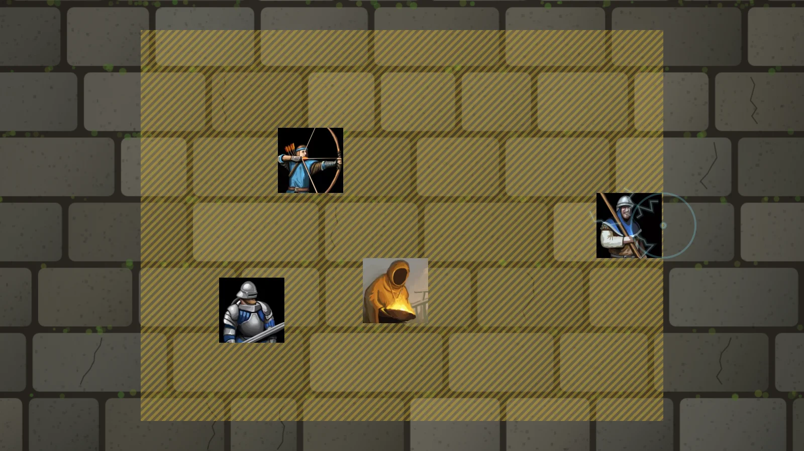

# 🧭 Don't Wander

**Draw a zone on the map — player tokens stay inside it until you say so!**

Players love running ahead of the story. Pausing the game stops them, but it stops everything
else too. Don't Wander lets the Game Master draw a Party Zone instead: player tokens move freely
inside it and simply can't leave until you grow the zone, switch it off or delete it.



[](https://buymeacoffee.com/mestredigital) [](https://mestredigital.online/pages/projetos-en)

---

# ✨ What makes it different

- ⏯️ **No pausing.** Chat, rolls, sheets and the rest of the table keep going — only the tokens
  that would wander off are held back.
- 🧩 **Built on native Regions.** A Party Zone is an ordinary Foundry Region with one extra
  behavior, so drawing, selecting, resizing and deleting it work like any other Region.
- 👑 **The GM is never blocked.** You can always move any token anywhere, players' tokens
  included.

---

# 🎁 Features

### 🟨 Draw a zone in one drag

**Draw Party Zone** sits in the Regions controls, right after Rectangle. Drag a rectangle on the
map and you get a gold Region that already carries the **Party Zone** behavior and is visible to
every player, so they can see where they may go. Only the GM sees the tool.

Any Region can become a zone too: open it, go to **Behaviors**, **Add Behavior** and pick
**Party Zone** — circles, polygons and every other shape work the same way.

### 🚧 Players stay inside

A token counts as inside when its **centre** is inside. Once a player's token is in a zone, a
move that would take it out runs into the edge instead: the token walks up to the border, gets a
**shock** — it flashes electric blue and shakes, sparks crackle around it, the barrier ripples
where it was hit, and a zap sounds for the whole table — and is thrown one grid space back the way
it came. The player also sees *"Wait for the GM — you can't leave the zone yet."* That covers
dragging, dragging with waypoints and moving with the keyboard; a move that leaves the zone and
comes back is stopped at the first edge it hits.

- **Zones that touch or overlap form one area** — walking from one into the next is free.
- **A token outside every zone** may only move *into* one. It can cross open ground on the way in,
  but it can't wander around outside — trying gets it shocked where it stands.
- **No active zones on the scene, no restriction.**

### ➕ Grow, shrink or lift a zone

- **Grow it:** select the zone with the Select tool, then draw with **Draw Party Zone** (or any
  other Region shape) — the new shape is added to the same zone. Or drag a shape's handles to
  resize it.
- **Cut a hole:** with the zone selected, turn on the Regions **Hole** tool and draw — the hole
  counts as outside.
- **Lift it:** disable the zone's **Party Zone** behavior in the Region's **Behaviors** tab to free
  the players and keep the zone for later, or delete the Region.

---

# 🚀 Getting started

1. **Enable the module** in your world.
2. **Open the Regions controls** and pick **Draw Party Zone**.
3. **Drag a rectangle** around the party. Their tokens now stay inside it.
4. **When the story moves on,** grow the zone, disable its behavior, or delete it.

> Party Zones follow the scene's **Levels**. A zone holds the tokens on the Levels its Region is
> in — the Level you drew it on, unless you change that in the Region's settings — whatever their
> elevation; a zone set to no Level holds tokens on all of them. A move that changes Level
> counts as leaving, and a Level with no zones on it is not restricted at all.
>
> The check runs on each player's own client: it keeps an honest table together, it is not meant
> to stop someone tampering from the browser console.

---

# 🔊 The shock sound

To use a different sound, go to **Game Settings → Configure Settings → Don't Wander → Shock
sound** and pick any audio file. Leave it empty and the shock is silent — the token still shakes.

---

# 🚀 Installation

Install via the Foundry VTT Module browser or use this manifest link:

```js
https://github.com/brunocalado/dont-wander/releases/latest/download/module.json
```

---

# 📜 License

* GNU General Public License version 3. See `LICENSE`.

* Shock sound: forceField_000 by Kenney, [CC0](https://creativecommons.org/publicdomain/zero/1.0/).
